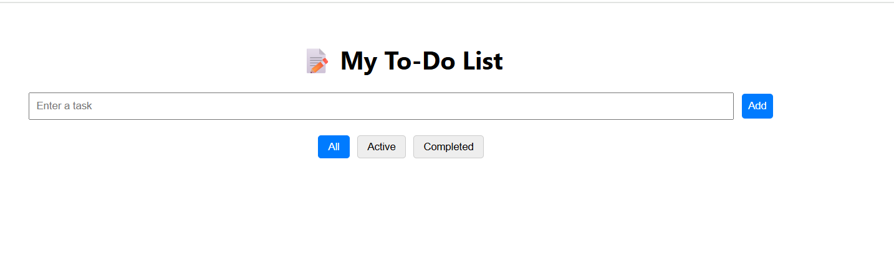

# To-Do List App 📝

A simple and clean ToDo list app built with JavaScript.  
It allows users to Create, Read, Update, and Delete tasks.  
It uses localStorage to persist tasks even after a browser refresh and demonstrates basic state management with a clean UI layout.

---

## 📸 Screenshot

---

## 🚀 Features

- Add / Edit / Delete tasks
- Save tasks to browser's localStorage
- Fully responsive UI for mobile & desktop
- Smooth animations and user-friendly layout

---

## 🔧 Tech Stack

- JavaScript
- HTML & CSS
- localStorage API

---

## 🔗 Live Demo

[🔗 View Live Project](https://vishal-webdev3.github.io/todoapp)

[📂 GitHub Repository](https://github.com/Vishal-webdev3/todoapp)

---

## 📁 Project Setup

### `npm install`
Installs all dependencies.

### `npm start`
Runs the app in development mode on `http://localhost:3000`

---

## 🙌 Author

**Vishal Payrumandala**  
Frontend Developer • Passionate Creator  
📧 vishalpayrumandala.dev@gmail.com  
🌐 [GitHub](https://github.com/Vishal-webdev3)

---

